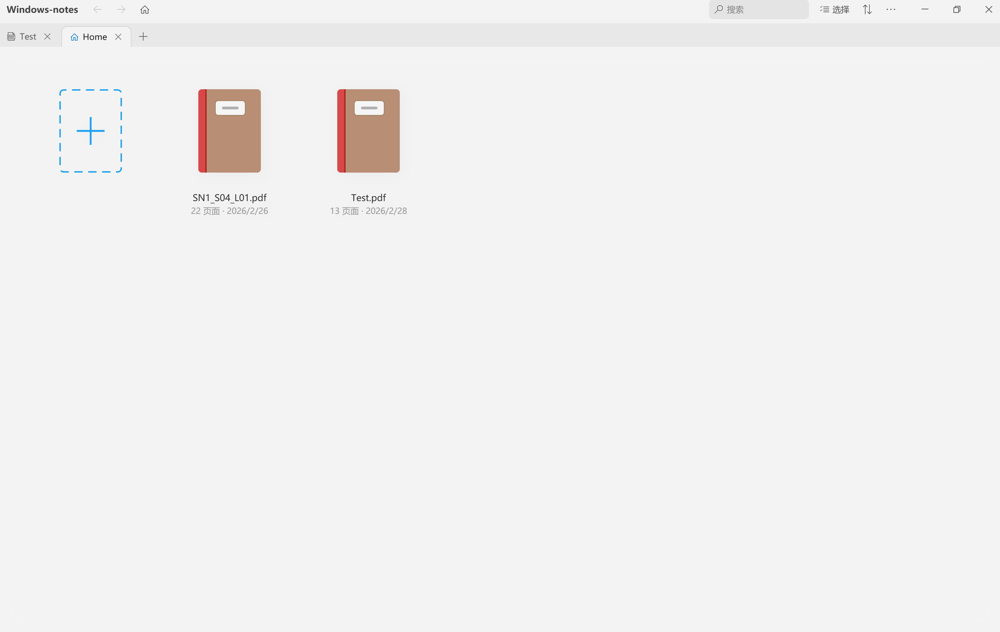
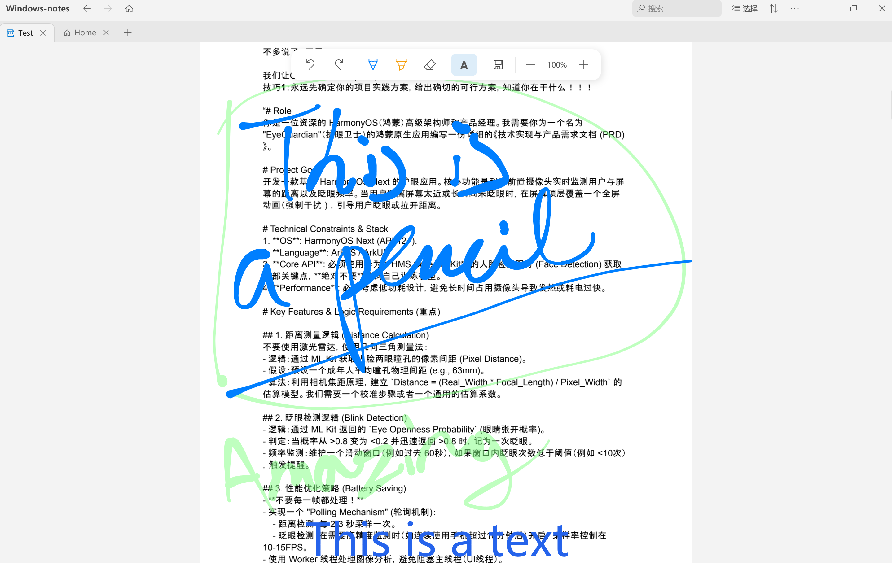
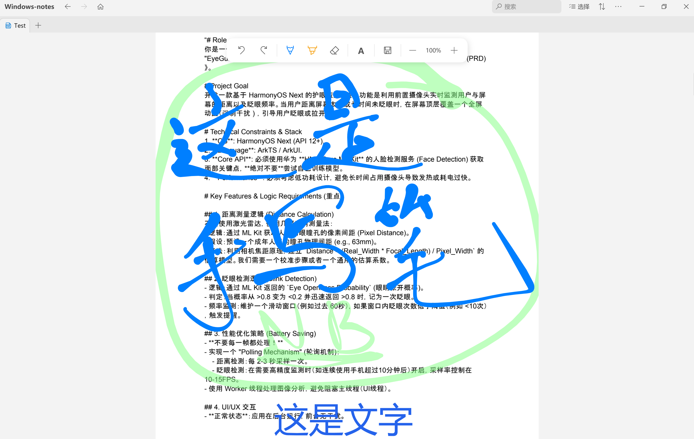

# Caelum

**The Modern Digital Ink Notetaker for Windows**

Caelum is a lightweight PDF annotation tool designed for Windows, built with WPF and .NET 8. It provides a smooth reading and writing experience with specialized support for stylus input, particularly for Huawei devices.

## Features

- **PDF Viewing & Annotation**: High-performance PDF rendering powered by PdfiumViewer. Open, read, and annotate your documents seamlessly.
- **Windows Ink Support**: Native support for Windows Ink allows you to write, draw, and highlight directly on PDFs using a digital pen or touch.
- **Huawei M-Pencil Integration**: Basic pen input works on Huawei MateBook devices. The M-Pencil double-tap eraser toggle is **not functional** as Huawei does not provide a public API for third-party apps. Standard stylus inking and barrel-button erasing still work.
- **Modern UI**: Clean, intuitive interface focused on productivity.
- **Recent Files**: Easily access your recently opened documents.

## Requirements

- **Operating System**: Windows 10 (version 1809 or later) or Windows 11.
- **Runtime**: .NET 8.0 Desktop Runtime.

## Usage

1. Launch the application.
2. Open a PDF file from the Home screen or drag and drop a file into the window.
3. Use your pen or mouse to annotate the document.
4. On Huawei MateBook devices, the M-Pencil pen input is supported for inking and annotation. **Note:** The M-Pencil double-tap eraser toggle does not work because Huawei does not expose this API to third-party apps.

## License

This project is intended for **Personal Use**. Contributions are welcome! Feel free to fork the repository, report issues, or submit pull requests to help improve the software with us.

See the [LICENSE](LICENSE) file for the full MIT License details.

---

# Caelum（Windows 笔记应用）

Windows 笔记应用是一款专为 Windows 设计的轻量级 PDF 阅读与批注工具，基于 WPF 和 .NET 8 开发。它提供了流畅的读写体验，并针对手写笔输入进行了特别优化，尤其是华为设备。

## 功能特点

- **PDF 阅读与批注**：基于 PdfiumViewer 的高性能 PDF 渲染引擎。您可以流畅地打开、阅读并批注 PDF 文档。
- **Windows Ink 支持**：原生支持 Windows Ink，允许您使用手写笔或触控直接在文档上书写、绘图和高亮。
- **华为 M-Pencil 基本支持**：在华为 MateBook 设备上支持 M-Pencil 的基本手写功能。M-Pencil 双击切换橡皮擦功能**无法使用**，因为华为未向第三方应用提供相关 API。标准的触控笔书写和笔身按钮擦除仍可正常使用。
- **现代化界面**：简洁直观的用户界面，助您专注于内容。
- **最近文件**：快速访问您最近打开的文档。

## 系统要求

- **操作系统**：Windows 10 (1809 版本或更高) / Windows 11。
- **运行环境**：.NET 8.0 桌面运行环境。

## 使用说明

1. 启动应用程序。
2. 在主页打开 PDF 文件，或直接将文件拖入窗口。
3. 使用手写笔或鼠标对文档进行批注。
4. 在华为 MateBook 设备上，M-Pencil 支持基本的手写与批注功能。**注意：** M-Pencil 双击切换橡皮擦功能不可用，因为华为未向第三方应用开放此 API。

## 许可协议

本项目旨在**个人使用**。欢迎 Fork 仓库、提交 Issue 或发送 Pull Request 来与我们共同改进软件！

详情请参阅 [LICENSE](LICENSE) 文件（MIT 许可证）。

详情请参阅 [LICENSE](LICENSE) 文件。
